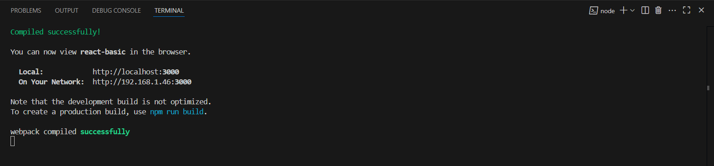
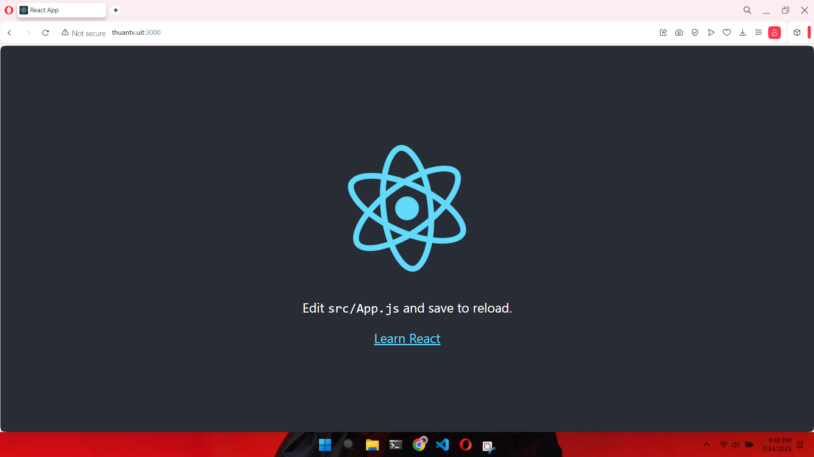
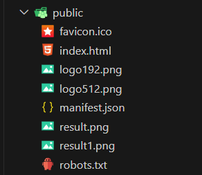
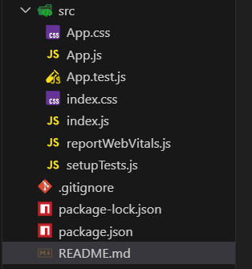
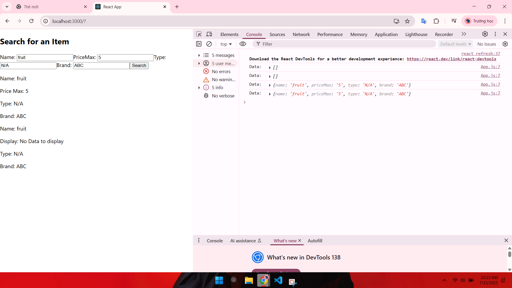

# REACT BASIC

## Information
Author: Thuan Tran Van     
Date Created: July 14 2025

## 1. Intruction and Environment
### Topics
1. Components
2. JSX
3. State
4. Forms
5. Events
6. Displaying Data
7. JSON Server
8. Hooks
9. Fetch
10. Router
11. Reducers
12. And More!

### Install
1. Create a repo of the React
```bash
npx create-react-app my-repo
```
2. Move into folder
```bash
cd my-repo
```
3. Run project with yarn or npm
```bash
yarn start or npm start
```
4. Result



## 2. Project Structure
### Public
1. index.html
Functioning as the principal HTML file of your React application, index.html acts as the entry point for your web application. It contains the foundational HTML structure that is initially displayed in the browser. Typically residing inside public/index.html, this file holds the basic HTML layout, including a element tagged with an id attribute, commonly labeled as ‘root’, where the React application integrates.

2. manifest.json
In a React application, particularly one created with tools like Create React App (CRA), a "manifest" typically refers to the Web App Manifest file, usually named **manifest.json**.     
This JSON file provides metadata about your web application, primarily for Progressive Web App (PWA) features. It allows the browser to present your web application to the user in a way that feels more like a native application.

3. Contains some images for the project
      



### src
1. index.css
The index.js file acts as the initial point of entry for your React application coded in JavaScript. Within src/index.js, you typically encounter the code responsible for rendering the root component of your application onto the DOM. It imports necessary modules and components, utilizing ReactDOM.render() to render the primary component, often denoted as App, into the root element specified in index.html.

2. App.js
In React, **App.js** typically serves as the root component of your application. It acts as the main container that holds and renders other components, forming the overall structure and layout of your user interface.

3. package.json
The **package.json** file in a React project, like any Node.js project, serves as a manifest file that contains metadata about the project and manages its dependencies and scripts. It is a fundamental part of working with Node Package Manager (npm) or Yarn.

4. gitignore
The **.gitignore** file is a plain text file used in Git repositories to specify intentionally untracked files that Git should ignore. In the context of a React project, it serves to prevent unnecessary or sensitive files from being committed to the version control system.

5. node_modules
In the context of a React project, "Node modules" primarily refers to the **node_modules** directory and the packages it contains. This directory is fundamental to how React projects, and indeed most modern JavaScript projects, manage their dependencies.

6. Webpack and Babel
Webpack in React is a static module bundler that takes all the individual JavaScript files (including React components) and other assets like CSS, images, and fonts, and bundles them into a single file or a few optimized files for deployment.      
Babel is a JavaScript compiler, or more accurately, a transpiler, that plays a crucial role in React development. Its primary function is to transform modern JavaScript code, including JSX (JavaScript XML) syntax used in React, into an older, more widely supported version of JavaScript (typically ES5).   
      
  

## 3. Components and JSX
1. In React, a single file can contain multiple functions, which must be imported into other components or files to be used. Alternatively, you can extract these functions into a separate file and import that file into the main file to access and utilize them. For example:
```bash
// utils.js
export function func1() { ... }
export function func2() { ... }

// App.js
import { func1, func2 } from './utils';
```

2. **import func1**: Used for **default imports**. The exported module is a single default export, and you can name it anything when importing.
```bash
// utils.js
export default function func1() { ... }

// App.js
import func1 from './utils'; // No braces, name can be anything
```

3. **import { func1 }**: Used for **named imports**. The function is exported as a named export, and you must import it with the exact name in braces
```bash
// utils.js
export function func1() { ... }

// App.js
import { func1 } from './utils'; // Must use exact name in braces
```
**Key difference**: Default import allows flexible naming; named import requires the exact exported name. Thanks!

4. JSX, or JavaScript XML, is a syntax extension for JavaScript that is commonly used with the React library for building user interfaces. It allows developers to write HTML-like code directly within their JavaScript files. 

## 4. Props
1. **Props** in React are used to pass data from a parent component to a child component, enabling dynamic and reusable components.   
Example:
```bash
// Parent.js
function Parent() {
  return <Child name="John" />;
}

// Child.js
function Child(props) {
  return <p>Hello, {props.name}!</p>;
}
```

2. **PropTypes** is a package in React used for type-checking props in components, ensuring they receive the correct data types and required props during development.
```bash
import PropTypes from 'prop-types';

function Child({ name, age }) {
  return <p>{name}, {age}</p>;
}

Child.propTypes = {
  name: PropTypes.string.isRequired,
  age: PropTypes.number,
};
```

## 5. State and useState
1. **useState** is a React Hook that allows functional components to manage state by declaring a state variable and a function to update it.
```bash
import { useState } from 'react';

function Counter() {
  const [count, setCount] = useState(0);

  const updateCounterClicked = () => {
    setCount(count + 1);
  }

  return (
    <div>
      <p>Count: {count}</p>
      <button onClick={updateCounterClicked}>Update Counter</button>
    </div>
  );
}
```

2. **Arrow Function** is a concise syntax for writing functions in JavaScript, introduced in ES6.
```bash
// Regular function
function add(a, b) {
  return a + b;
}

// Arrow function
const add = (a, b) => a + b;
```

## 6. Form and Event
1. In React, a **form** is a UI component used to collect user input (e.g., text, selections) via elements like <input>, <textarea>, or <select>. It manages input data using state (often with useState) and handles submission with event handlers.

- **State** (input) tracks input value.
- **onChange** updates state with user input.
- **onSubmit** handles form submission, using e.preventDefault() to prevent page refresh.
- Props can pass data or functions to customize form behavior across components.

2. In React, an **event** is a user or system action (e.g., click, input change, key press) handled by event handlers in components, typically passed as props or defined in JSX using camelCase attributes (e.g., onClick, onChange).

 
